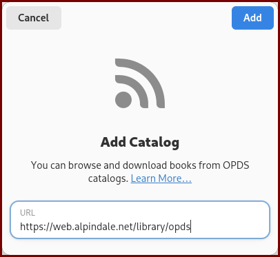

# OPDS Support

OPDS (Open Publication Distribution System) is a protocol for distributing digital publications. This collection uses [Calibre](https://calibre-ebook.com/) to generate OPDS feeds, which is supported by many devices and apps.

## Supported Operating Systems

- Android
- iOS
- Windows
- MacOS
- Linux


I only have Android and Linux, so I can't test other operating systems. You can simply look up the most recommended OPDS reader for your operating system. For iOS, the most popular option seems to be [KyBook 3 Ebook Reader](https://apps.apple.com/lv/app/kybook-3-ebook-reader/id1348198785), and for Windows, the most popular option is [Thorium Reader](https://github.com/edrlab/thorium-reader). This one is also available on Linux and MacOS.

## Linux

For Linux, I recommend using [Foliate](https://github.com/johnfactotum/foliate). It's a free and open source e-book reader that supports OPDS feeds, and is simple to use.

### Setting up Foliate

Please refer to the [Foliate documentation](https://johnfactotum.github.io/foliate/) on how to install it. On Arch Linux, you can run:

```sh
sudo pacman -S foliate
```

Then, launch the app. Once inside Foliate, click on the `+ Add Catalog...` button on the left sidebar.



Type in `https://web.alpindale.net/library/opds` in the URL field, and click `Add`.

You will be prompted to enter a username and password. Use the same credentials you use to log in to the web interface.

> Click on `Remember password` to save your credentials.

Now, you should see the collection in your Foliate app. You can switch between the different libraries by clicking on them. You can now search for your favorite light novels and read them! Make sure you select `calibre Library` on the left sidebar.


## Android
For Android, I recommend using [Moon+ Reader](https://play.google.com/store/apps/details?id=com.flyersoft.moonreader&hl=en).

### Setting up Moon+ Reader

Open the hamburger menu on the top left, and click on `Net Library`. Then click on the three dots on the top right, and click on `Add new catalog`. Enter the URL `https://web.alpindale.net/library/opds` and click `Add`. You can optionally enter a Catalog Name, if you want to. It will ask you for a username and password, use the same credentials you use to log in to the web interface.


The library should appear in the Net Library section. You can now search for your favorite light novels and read them! You may switch between the different libraries by clicking on them at the bottom of the page.